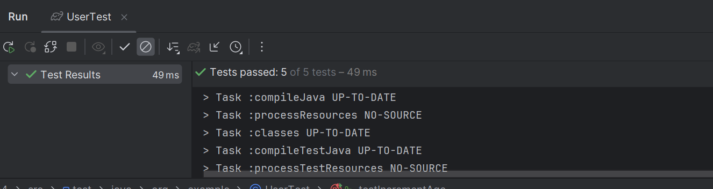
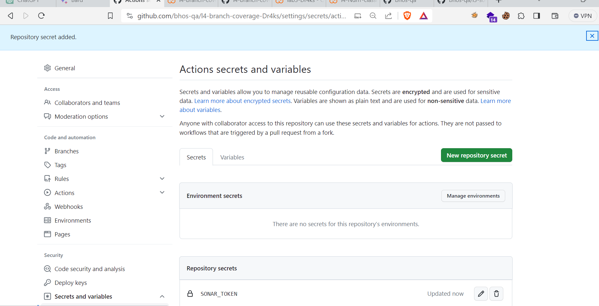
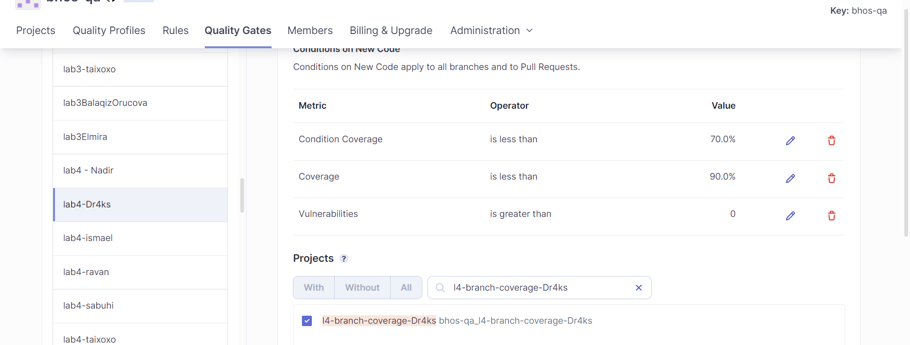
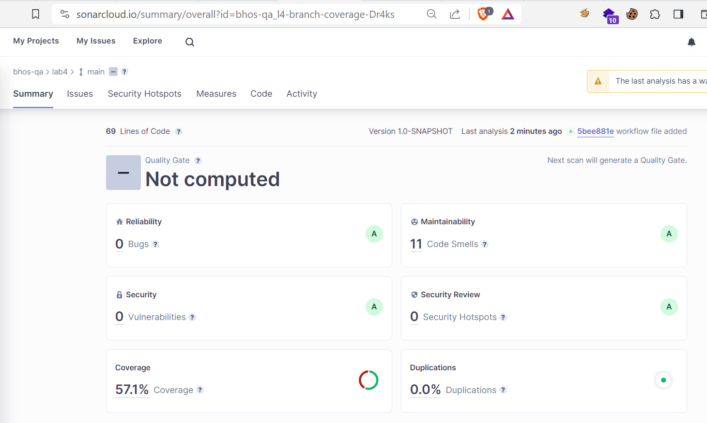

Hello, now I provide Task 4 with you.

That's the part, we write vulnerable Java code and it should be detected by SonarCloud.

First of all , let's talk about your subjective learning outputs from statement/branch/predicate coverage researches.

From [here](coverage.md) , you can see our **coverage.md** file.   

Now, it's time to write 10 methods due to our logic.
I wrote like [this](src/main/java/org/example/User.java),

Now, it's time to code Junit 5 methods.
I wrote like [this](src/test/java/org/example/UserTest.java)

Let's check our Junit test methods.

Now, it's time to check our code on Sonarcloud.
That's why first we add our SONAR_TOKEN secret in our repository.

Then, we need to configure Quality Gate for our project's new code section.

As a result we did section of branch coverage and code coverage.

Now, it's time to code our build.gradle file like [this](build.gradle).

Finally, we need to make Github Actions part of our task. For this, we need to configure our workflow file like [this](.github/workflows/workflow.yml).

Here's our SonarCloud result.

Now, it's time to create PR from 'feature/lab4' to 'develop' branch.