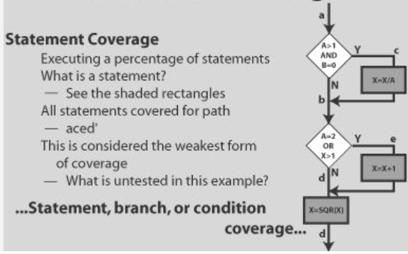
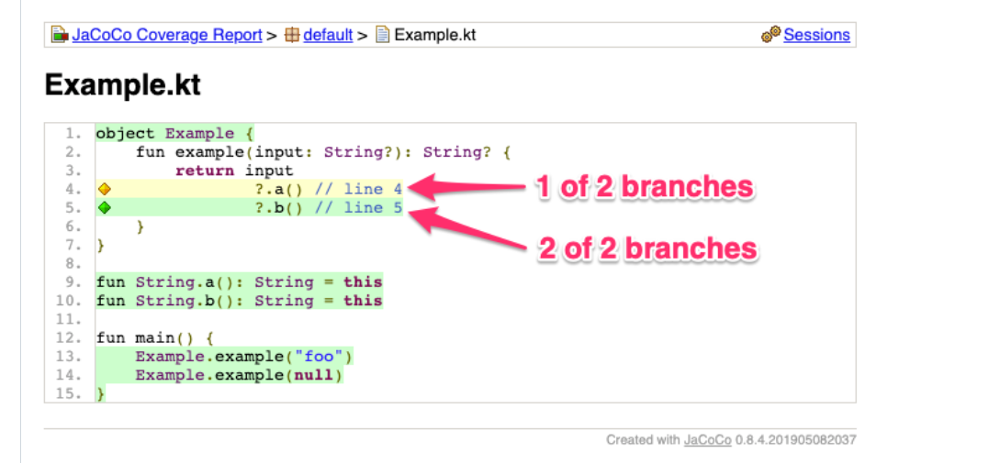
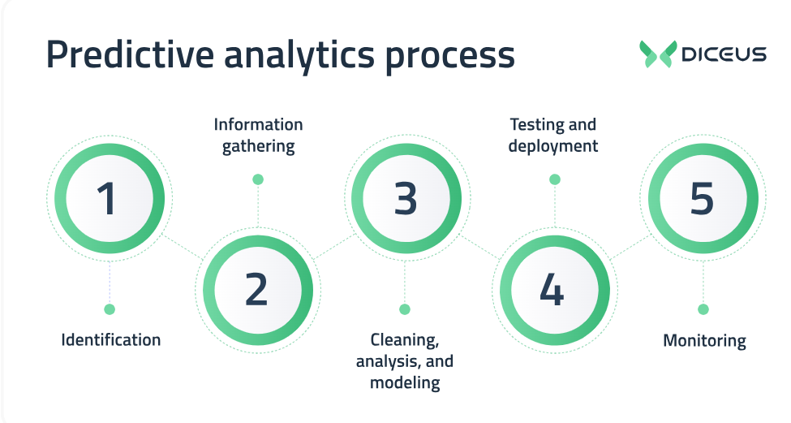

Let's talk about statement/branch/predicate coverage researches.

**Statement Coverage=>**

Statement coverage is a good starting point for measuring code coverage, but it is not enough. It is possible to have high statement coverage but low branch coverage, which means that not all of the possible code paths are being tested.

**Branch Coverage=>**

Branch coverage is a more comprehensive metric for measuring code coverage. It ensures that all of the possible code paths are being tested, which can help to identify more bugs.

**Predicate Coverage=>**

Predicate coverage is the most comprehensive metric for measuring code coverage. It ensures that all of the possible logical conditions are being tested. However, predicate coverage can be difficult and time-consuming to achieve.

